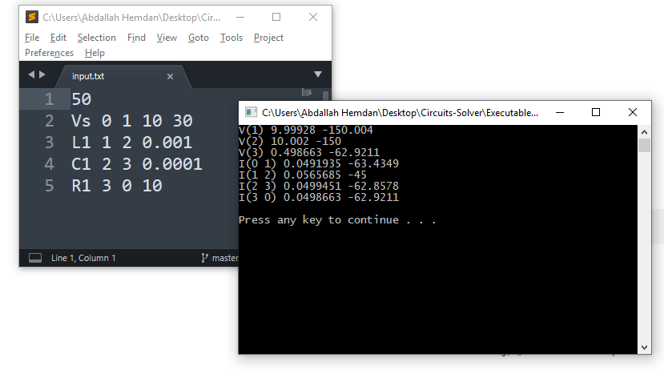

## 🔌Circuits Solver

Circuits Solver ia a simple tool to simulate and solve AC circuits.

## 🎯The project objective

The mission is to develop a CAD (Computer Aided Design) tool
to simulate simple AC circuits that contains :

<ol>
  <li>independent voltage sources</li>
  <li>independent current sources</li>
  <li>dependent voltage source</li>
  <li>dependent current source</li>
  <li>resistors</li>
  <li>capacitors</li>
  <li>inductors</li>
</ol>

  

